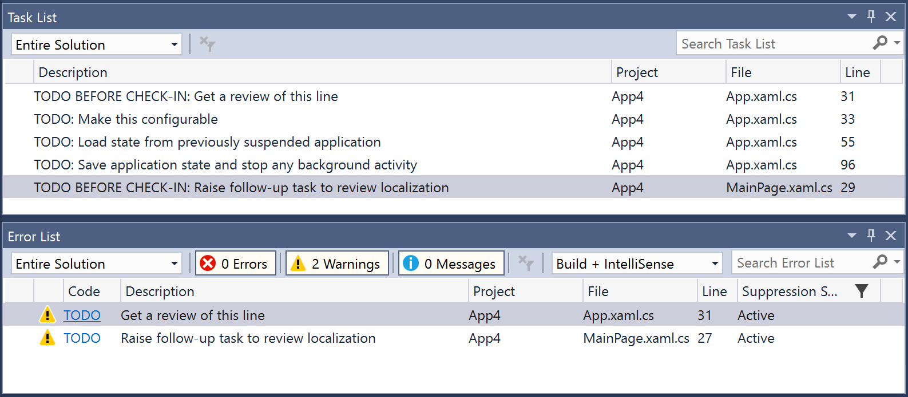

# Warn About TODOs

[](LICENSE)

Download this extension from the [VS Gallery](https://marketplace.visualstudio.com/items?itemName=MattLaceyLtd.WarnAboutTODOs)

---------------------------------------

Visual Studio automatically takes code comments that include `TODO` and turns them into User Tasks that are displayed on the Task List.  
This extension takes those same tasks and also creates warnings for them.  
This can be useful if you don't look at the Task List or want an extra reminder to do something before committing a change.

Works for single-line, multi-line, and documentation comments in both VB.Net and C#.

## Configuration

The default behavior is to create a warning about any comment line that starts with `TODO`.

### Simple configuration

This can be overridden by including an `AdditionalFile` in the project called **todo-warn.config**.
If this file exists, warnings will only be reported for comments that start with any of the non-blank lines in that file.

For example, if the config file contained the line `TODO BEFORE CHECK-IN`, only comments that start that way are reported.



### Advanced configuration

It is possible to control the type of error that is reported and filter beyond just how a comment starts.

#### Setting the output type

A line in the config file may, optionally, start with one of the following.

`[INFO]` - which will cause any comment identified by the rest of the line to be reported as information/message.
`[ERROR]` - which will cause any comment identified by the rest of the line to be reported as an error. Errors reported in this way will not cause a build to fail as they are separate from the build process.
`[WARN]` - which will cause any comment identified by the rest of the line to be reported as a warning. This is the same as not including any of these output indicators.

#### Filtering output by line content

In addition to a config file line containing plain text, that is treated as the line start value to use when identifying comments of interest, it is also possible for a line in a config file to be comprised of "config blocks."

A config block takes the format `[KEYWORD(value)]`.

The following keywords are supported

- STARTS
- CONTAINS
- DOESNOTCONTAIN

Each config block is optional but must be listed in the order shown above and can only be included once.

This allows for the creation of rules such as "Show a message if a comment starting 'TODO' includes an issue number but isn't 'low-priority'."
It would look like: `[INFO][STARTS(TODO)][CONTAINS(Issue#)][DOESNOTCONTAIN(low-priority)]`.

Or you could have an error displayed if a comment line included, at any point, the text "before check-in" with the line `[ERROR][CONTAINS(before check-in)]`.

#### Example configuration

The following are all examples of valid lines in a config file.

```
TO DO
[WARN]temp
[WARN]for-review
[WARN]for review
[ERROR][CONTAINS(before check-in)]
[WARN][STARTS(TODO)][DOESNOTCONTAIN(Issue#)]
[INFO][STARTS(TODO)][CONTAINS(Issue#)][DOESNOTCONTAIN(low-priority)]
```
